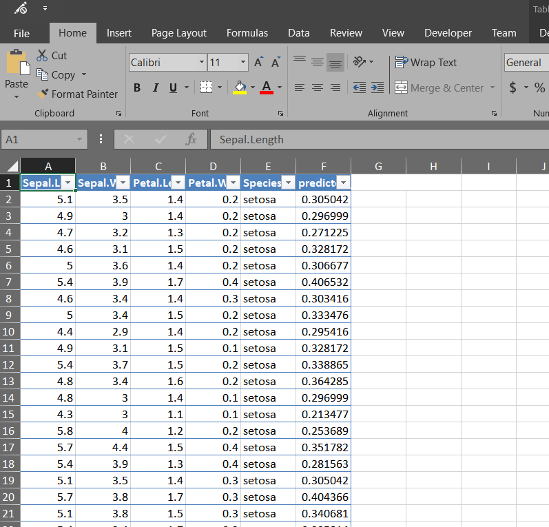

Your model is only useful once it is in production.  This tutorial shows how to quickly convert a GLM to an Excel formula in 4 steps.

## Step 1: Set Up

Load the libraries.  The `tidyverse` and `broom` packages have tools to make the data manipulation easier.  The library `openxlsx` creates Excel files.

```{r warning = F, message = F}
library(tidyverse)
library(broom)
library(openxlsx)
library(kableExtra)
excel = createWorkbook() #creates an Excel Workbook
```

## Step 2: Fit a model

A linear model relates the target variable to the input variables with a mathematical formula.  In this example, there are just two inputs, but the results generalize to any number of inputs.

$$g(Y) = \beta_0 + \beta_1 X_1 + \beta_2 X_2$$

Often a log transform is applied to the input variables.  In this example, let's take the log of $X_1$.  The function `g` is the link function, and is commonly a log as well for regression problems.

$$log(Y) = \beta_0 + \beta_1 X_1 + \beta_2 log(X_2)$$

Fit a model and look at the coefficients.  In this example, $\beta_0 = -1.83, \beta_1 = 0.053, \beta_2 = 1.37$.  This means that the response `Petal.Width` is related to the inputs `Sepal.Width` and `Petal.Length` by the formula

$$log(Y) = -1.83 + 0.053 X_1 + 1.37 log(X_2)$$

```{r}
glm <- glm(Petal.Width ~ Sepal.Width + log(Petal.Length), 
           family = gaussian(link = "log"),
           data = iris)
glm %>% tidy() %>% select(term, estimate) %>% kable("html")
```

Note that this is using the `glm` function which means that this same code will work for any combination of link function and response distribution.  For example, if using logistic regression, just change the `family` to be `binomial(link = "logit")`.

## Step 3: Export

We could just hard-code these values into Excel, but because these coefficients are really *random variables*, they change when the data changes.  Hard-coding values in this case would lead to a high-maintenance model.  Each time that the data was changed we would need to go back and update these values!

Instead, add a worksheet to the Excel workbook to store the coefficients.

```{r}
addWorksheet(excel, "coefficients")
```

Then, copy the values into this table.

```{r}
glm %>% tidy() %>% select(term, estimate) %>% writeData(excel, "coefficients", .)
```

Do the same for the model's predicted values.

```{r}
addWorksheet(excel, "R predictions")
iris %>% 
  mutate(predicted_petal_width = predict(glm, iris, type = "response")) %>% 
  writeDataTable(excel, "R predictions", .)
```


## Step 4: Verify the results

The Excel file that is still in R at this point.  Save it as an `.xlsx` file, and then open the file in Excel and check the formula.

```{r}
saveWorkbook(excel, "R GLM in Excel.xlsx", overwrite = T)
```

When you open the file in Excel you will see the model's predictions.



Now create a new column which will make these predictions in an Excel formula.  In a new column, enter


`=EXP(coefficients!$B$2+coefficients!$B$3*[@[Sepal.Width]])*[@[Petal.Length]]^coefficients!$B$4`


As a check, these values should be identical to the predictions from the R model in the column `predicted_petal_width`.


If you are wondering why this formula looks different than the first one, than you are on the right track.  There is a bit of algebra to make it simpler.

Start with the original formula

$$log(Y) = \beta_0 + \beta_1 X_1 + \beta_2 log(X_2)$$
Then cancel out the log on the left side by taking the exponent.

$$Y = exp( \beta_0 + \beta_1 X_1 + \beta_2 log(X_2))$$

Use the definition of the logarithm to simplify the last term.

$$e^{\beta_0 + \beta_1 X_1} e^{log( X_2^{\beta_2})} =  e^{\beta_0 + \beta_1 X_1} X_2^{\beta_2} $$

You can use this to simplify models which have a number of log-transformed inputs by taking the X to the power of Beta.


